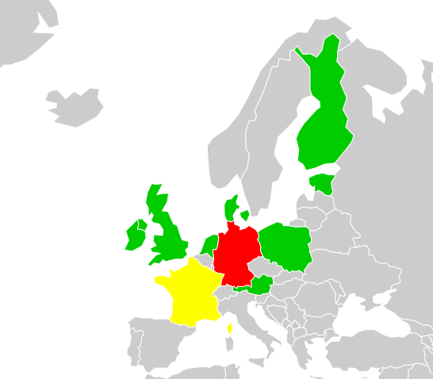

# Visualisation of historical EU crime data

A python script parses a .tsv data file containing historical EU data on Crime.  The data is then stored in a sqlite database and served over an API.

A javascript visualisation displays the information to the user.

## Dependencies

* Python 3 (Tested with 3.5.0)
* Flask (Tested with 0.11.1)
* Pandas (Tested with 0.18.1)

## How to use

Assuming you have all dependencies set up:

	$ git clone https://github.com/johnny-morrice/crimemap.git
	$ cd crimemap
	$ export FLASK_APP=crimemap/crimemap.py
	$ flask initdb $PWD/data/crim_hist.tsv
	$ flask run

## HTTP GET API route examples

Try:

* `/api/dates`
* `/api/dates/1990`
* `/api/countries`
* `/api/countries/DK`

## Data source

[Crimes Recorded by the police (1950-2000)](https://data.europa.eu/euodp/en/data/dataset/qdxC0mEw46A0rQODgMzCQ)

## Credits

John Morrice

[github](https://github.com/johnny-morrice)

[homepage](http://jmorrice.teoma.io)
