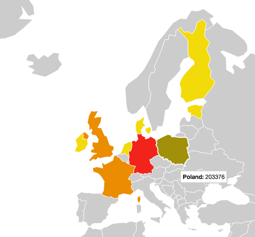

# Visualisation of historical EU crime data

A python script parses a .tsv data file containing historical EU data on Crime.  The data is then stored in a sqlite database and served over an API.

A javascript visualisation displays the information to the user.

## Fun HTTP GET API routes

Try:

* `/api/dates`
* `/api/dates/1990`
* `/api/countries`
* `/api/countries/DK`

## Data source

[Crimes Recorded by the police (1950-2000)](https://data.europa.eu/euodp/en/data/dataset/qdxC0mEw46A0rQODgMzCQ)

## Credits

John Morrice

[github](https://github.com/johnny-morrice)

[homepage](http://jmorrice.teoma.io)
